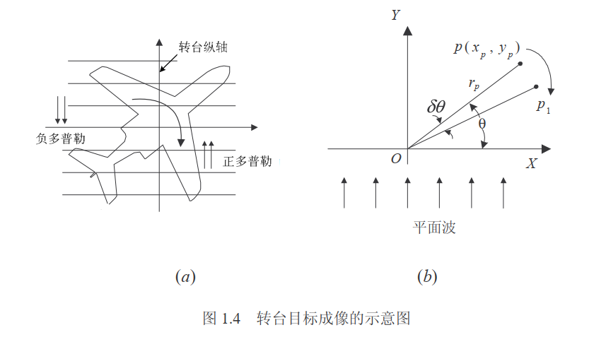

# ISAR

**介绍ISAR成像的基本原理**

**主要参考文献为保铮院士的《雷达成像技术》**

****

## 应用背景

雷达发明是无线电发展史重要里程碑，其可以全天候、全天时、远距离对目标进行检测和定位。

早期由于雷达分辨能力较低，分辨单元通常远大于目标，因此雷达是将观测对象视为“点”来测定位置和运动参数。随着雷达分辨能力的提升，当分辨单元远小于目标尺寸时，可以对目标进行成像。

* 对于**距离维分辨率**而言，主要通过增大信号的带宽来实现:

$$
\rho_{r}=c/2B
$$

* **横向分辨率**主要依靠减小波束宽度，可采用大孔径的天线，但为了获得比较精准的分辨率，天线的孔径要求过大，因此，多采用阵列天线。

  利用飞行的雷达平台对地面场景获得高的方位分辨率还可以使用多普勒效应来解释，当飞机以一定速度水平飞行时，地面的固定目标方位不同，其视线与雷达的速度向量的夹角也不相同，即他们有不同的相对径向速度和多普勒。因此对同一波束里的固定目标作多普勒分析，**只要多普勒分辨率足够高，仍然可将波束无法分辨的目标加以分辨。**（多普勒锐化）

合成孔径是利用雷达与目标之间的相对运动形成的，这里是指目标不动，而雷达平台作直线运动。而如果**雷达平台不同，目标运动，则是逆合成孔径雷达（ISAR）**早在上世纪80年代初，就实现了非合作式目标的逆合成孔径雷达成像，目前已经获得了广泛的应用。 

## 技术简介

目标的运动可以分解为平动和转动两个分量。

**平动指该参考点沿目标运动轨迹移动，目标相对于雷达射线的姿态保持不变**

**转动是指目标围绕该参考点转动**

在只有平动分量的情况下，目标上各散射点回波的多普勒完全相同，对雷达成像没有贡献。设法将平动分量补偿掉，相当于将目标的参考点移到转台轴上，而成为对转台目标成像

纵向分辨率
$$
\rho_{r}=c/2B
$$

​       如上图所示，当目标以顺时针方向转动时，目标上各散射点的多普勒值是不同的v，位于轴线上的散射点没有相对于雷达的径向运动，故子回波的多普勒为0，而在其右或左两侧的多普勒分别为正或负，且离轴线越远，多普勒值也越大。

​        在1.4（b）中，设在相邻两次观测中目标对于雷达视线转过了一个很小的角度$\delta\theta$，它上面的某一个散射点则从$P$点移到了$P_{1}$点，其纵向位移为：

$\Delta y_{p}=r_{p}sin(\theta-\delta\theta)-r_{p}sin\theta=-x_{p}sin\delta\theta-y_{p}(1-cos\delta\theta)$

式中$x_{p}$，$y_{p}$为散射点P相对于转台轴心的坐标，且$x_{p}=r_{p}cos\theta$，$y_{p}=r_{p}sin\theta$

纵向位移$$\Delta y_{p}$引起的子回波的相位变化为
$$
\Delta\varphi_{p}=-\frac{4\pi}{\lambda}[-x_{p}sin\delta\theta-y_{p}(1-cos\delta\theta)]
$$
若$\delta \theta$很小，则上式可近似为
$$
\Delta\varphi_{p}\approx-\frac{4\pi}{\lambda}x_{p}\delta\theta
$$

​     上式表明，两次回波的相位差正比于横距$x_{p}$.该散射点相邻两个周期的回波相差一个相位旋转因子$exp(j\frac{4\pi}{\lambda}\delta\theta x_{p})$，当转台连续转动时，子回波的相位变化表现为多普勒，$x_{p}$越大，则该散射点子回波的多普勒频率也越高。

​      目标均匀转动，在观测过程中接收到M次回波，即总转角$\Delta \theta=M\delta\theta$，当两散射点的横向距离差为$\Delta x$时，两散射点子回波总的相位差为

   用傅里叶变换作为多普勒分析时，只要$\Delta\Phi_{M}\geq2\pi$，两点即可分辨，即此时的横距分辨率
$$
\rho_{a}=\frac{\lambda}{2\Delta\theta}
$$

