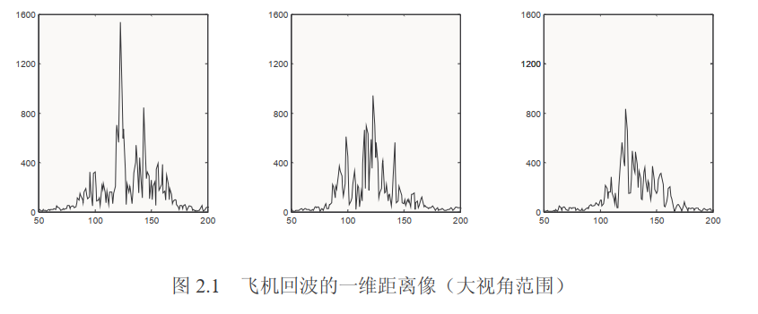

# 距离高分辨和一维距离像

雷达使用宽频带信号后，距离分辨单元可以小到亚米级。

当目标的尺寸远大于雷达的波长时，目标可以用散射点模型近似表示。

一般情况下，**视角变化十余度，散射点在目标上的位置和强度近似不变**，使用微波雷达对目标做ISAR成像，要求目标不超过$3^\circ\sim 5^\circ$的转动，分析时使用散射点模型是合适的。

在散射点模型假设条件下，**目标的回波可视为它的众多散射点子回波之和**。宽频带雷达一般都采用时宽较大的宽频带信号，通过匹配滤波将其压缩成窄脉冲，由于窄脉冲的宽度远小于目标的长度，**目标回波的窄脉冲分布相当于三维分布的目标散射点子回波之和**，在平面波的条件下，相当于三位子回波以向量和的方式在雷达射线上的投影，即相同距离单元里的子回波作向量相加。

**一维距离像随视角变化而具有的峰值位置缓变性和峰值幅度快变性可作为目标特性识别的基础**

## 宽带信号的逆滤波、匹配滤波和脉冲压缩

​      根据散射点模型，设散射点为理想的几何点，若发射信号为$p(t)e^{j2\pi f_{c}t}$，将接收到的回波作相干检波（即乘以$e^{-j2\pi f_{c}t}$），对不同距离多个散射点目标，其基频回波可写成：
$$
s_{r}(t)=\sum_{i}A_{i}p(t-\frac{2R_{i}}{c})e^{-j\frac{4\pi f_c}{c}R_{i}}
$$
$A_{i}$和$R_{i}(t_{m})$分别为第$i$个散射点回波的幅度和某时刻的距离;$p()$为归一化的回波包络；$f_{c}$为载波频率，$c$为光速。

​      若以单频脉冲发射，脉冲越窄，信号频带越宽。但发射很窄的脉冲，要有很高的峰值功率，实际困难较大，通常采用大时宽的宽频带信号，接收后通过处理得到窄脉冲。将上式转换到频域中研究：
$$
S_{r}(f)=\sum_{i}A_{i}P(f)e^{-j\frac{4\pi (f_{c}+f)}{c}R_{i}}
$$

